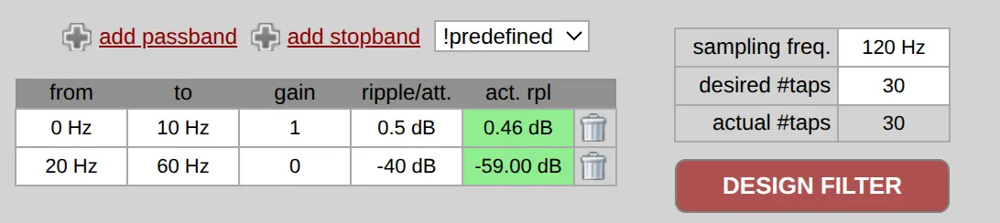
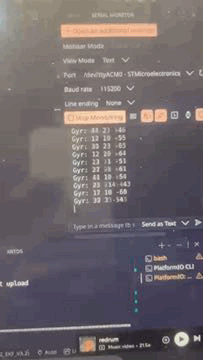
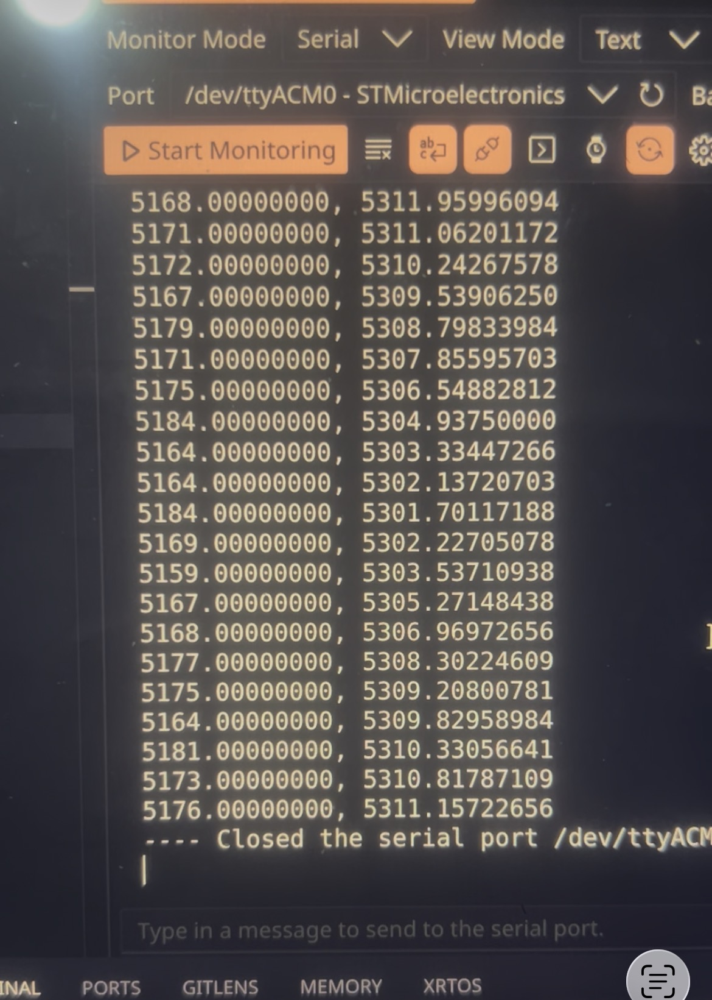

# Overview

The original aims of this project was to:
- Interface an STM32 microcontroller with an IMU and a Barometer
- Use Direct Memory Allocation triggered by interrupts for obtaining readings over SPI
- Filter readings with FIR filter
- Use EKF for sensor fusion and accurate altitude estimation

Achieved so far:
- SPI communication with IMU using DMA and interrupts
- Designed FIR filter coefficients for acc/gyro data

Still left to implement:
- Barometer driver
- Calibration
- Replace Phil's Lab EKF and FIR implementations with own ones, incorporating baro
- Get Kalman Filtering working

# System Architecture

### IMU Drivers (LSM.c, LSM.h)
- IMU DMA drivers to obtain accelerometer and gyroscope raw values as soon as they are ready - less direct involvement from the processor
- IMU in question (LSM6DS) has two interrupt pins

### Threads (main.c)
- FreeRTOS threads were used to schedule the Predict and Update steps of the EKF

### FIR Filtering (FIRFilter.c, FIRFilter.h)
- Low pass filtering of raw accelerometer and gyroscope measurements
- No non-linear phase shifts of signals like with IIR

### EKF
- Without a barometer, the EKF would have been used for accurate prediction of roll and pitch angles
- These would be used to find acceleration with respect to the world's z-axis 
- Acceleration would be double integrated to find displacement, and therefore used to update altitude value

## Parks McLellan FIR Filter Design

http://t-filter.engineerjs.com - Tool used to derive coefficients

A relatively small number of taps was used given the relatively limited processing power. A claim made by Phil's lab is that anything more than 64 taps on an STM32F4 would be difficult to process.

The coefficients were chosen to form a lowpass filter. The nature of a hand-tested altitude sensor would mean that movements are relatively slow, hence a cutoff frequency of 10Hz was suitable here.

A low sampling frequency was used in order to more easily stay within ripple limits.

The Park-McLellan method for filter design is better than simpler alternatives, as it can produce a narrower transition band for the same filter order.

## Demo

### High-frequency Gyro over DMA (960Hz):

### Accel + Gyro:

### FIR Filtered Data (with offsets):

